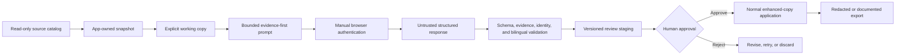
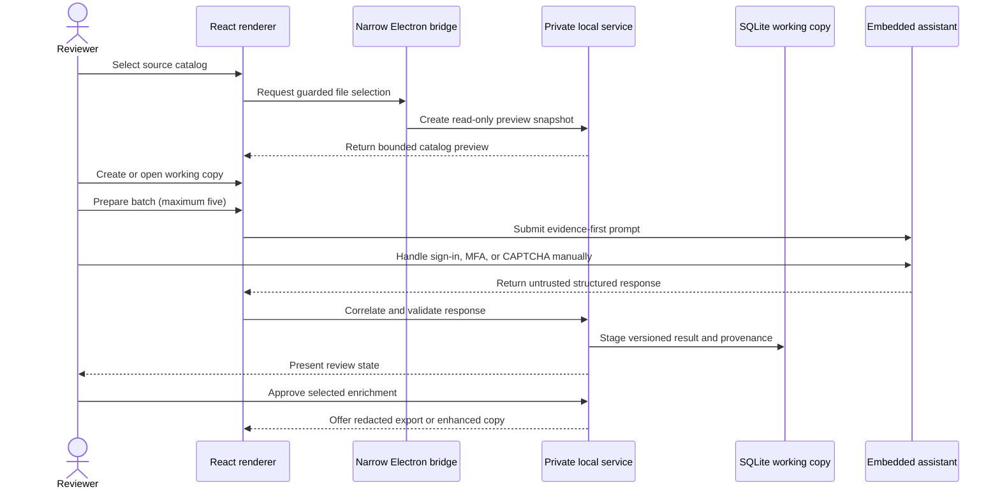

# Research Studio — Engineering Case Study

**A guarded, local-first desktop workflow for enriching a Chinese/English short-drama catalog without modifying its source database.**

Active private development · Windows x64 · Verified private alpha `0.1.0-alpha.21`

> **Application-source-free by design:** this public repository contains original documentation, publication-check automation, synthetic examples, and redistribution-safe visuals. The application source, portable builds, catalog, browser material, and private diagnostics remain private because a standalone redistribution license has not been reviewed.

[Portfolio](https://nouraldin-farge-engineering.awdsqecxzr.chatgpt.site) · [Evidence guide](docs/README.md) · [Verification snapshot](docs/verification-evidence.md) · [Threat model](docs/threat-model.md) · [Engineering lessons](docs/engineering-notes.md)

*Synthetic workflow illustration. The sample titles are fabricated; no private catalog rows or application screenshots are shown.*

## The case in 60 seconds

Research Studio began as a focused module inside SilkReel Windows 5.8.214. Extracting it exposed a harder engineering problem than building a metadata form: how do you research and enrich a large catalog while keeping the source trustworthy, browser authentication manual, model output untrusted, and portable upgrades recoverable?

The standalone private alpha answers that with explicit boundaries:

- inspect an app-owned snapshot rather than touching the source catalog;
- require a working copy before any schema or enrichment write;
- prepare evidence-first prompts in batches of no more than five records;
- keep sign-in, MFA, CAPTCHA, and account challenges under user control;
- correlate, validate, stage, and review every model response;
- use human approval for normal enhanced-copy application; and
- verify the packaged Electron runtime before transactionally activating a portable ZIP.

## At a glance

| Dimension | Evidence-backed result |
| --- | --- |
| Product scope | Standalone extraction of the Research Studio module from SilkReel Windows 5.8.214 |
| Inspected private catalog | 31,521 series · 2,242,170 episodes · 31,050 covers · 305,842 primary tag associations |
| Source-data boundary | Disposable preview snapshot, read-only connection, SQLite `query_only`, explicit working copy |
| AI boundary | Manual authentication, bounded prompts, correlated capture, schema and bilingual quality gates |
| Production boundary | Sandboxed Electron renderer, narrow preload bridge, application-private Windows named pipe |
| Release boundary | Private portable ZIP only; no installer, service, scheduled task, or public application release |
| Recovery evidence | Native ABI query, packaged UI smoke test, path-with-spaces test, selective state preservation, forced rollback |
| Public availability | Documentation-only case study; no source, binary, catalog, session, or private result is distributed |

## Choose a reading path

| If you want to understand… | Start here |
| --- | --- |
| The complete product and trust flow | Continue with [Workflow](#workflow) and [Architecture](#architecture) |
| The most important technical choices | [Design decisions](docs/design-decisions.md) |
| Privacy, browser, database, and network risks | [Threat model](docs/threat-model.md) |
| What was actually tested | [Verification evidence](docs/verification-evidence.md) |
| Failures, fixes, and lessons learned | [Engineering notes](docs/engineering-notes.md) |
| A safe example of the output shape | [Fabricated export fixture](docs/synthetic-export.example.json) |
| Licensing and public-release limits | [Availability and ownership](#availability-and-ownership) |

## The engineering problem

Catalog enrichment concentrates several failure modes in one workflow:

| Risk | Why it matters | Design response |
| --- | --- | --- |
| Source-database mutation | Even opening SQLite incorrectly can create coordination files | Inspect an app-owned snapshot and require an explicit working copy for writes |
| Plausible but incorrect AI output | Valid JSON can still describe the wrong title or invent evidence | Correlate record identity, validate domain quality, and keep a human review step |
| Browser-session exposure | Automating credentials or publishing captures would create a serious privacy boundary failure | Persist the dedicated session locally while keeping authentication challenges manual |
| Desktop attack surface | A localhost service or broad preload API increases reachable authority | Use a narrow Electron bridge and a private named pipe in packaged production |
| Native packaging drift | A build can succeed while an Electron-native SQLite binary cannot load | Execute a real SQLite query in the packaged Electron runtime |
| Portable upgrade loss | Replacing a folder can erase durable state or strand a broken active build | Preserve only durable data and restore the previous build after failed activation |

## Workflow

1. Open a compatible SQLite catalog in read-only preview mode.
2. Inspect an app-owned consistent snapshot without creating WAL or SHM files beside the source.
3. Create an explicit working copy before enabling schema or enrichment writes.
4. Prepare one precision prompt or a batch of no more than five titles.
5. Complete sign-in, MFA, CAPTCHA, and account challenges manually in the embedded browser.
6. Capture only the response correlated with the submitted prompt and expected record order.
7. Validate schema, evidence, descriptions, ordered bilingual tags, and record identity.
8. Stage a versioned result for review; invalid or incomplete output remains inspectable and retryable.
9. Approve selected results for normal enhanced-copy application.
10. Export redacted JSON, CSV, JSONL, or a documented enhanced SQLite copy.

## Database safety

Opening a database never enables enrichment writes. The implementation uses an app-owned snapshot, a read-only SQLite connection, and `query_only` for inspection. A user must explicitly create or open a working copy before schema installation or enrichment changes, and schema mutation backs up that copy first.

*The source and working copy are different authorities. Proposed metadata is versioned separately; the original description is preserved.*

## Model and browser safety

The assistant runs inside the single Electron window in a dedicated persistent session. Authentication remains manual, while the application monitors response activity, correlates the visible answer with the active prompt pack, validates the returned contract, and preserves incomplete output for review or retry.

Syntactically valid output is not treated as automatically correct. Quality gates check required Chinese/English fields, description substance, evidence shape, controlled tag ordering, expected record count, and record identity.

## Architecture

| Layer | Responsibility | Deliberate boundary |
| --- | --- | --- |
| React + TypeScript | Reviewer workflow, progress, validation, approval, and exports | No direct filesystem, database, or credential authority |
| Electron | Sandboxed desktop window, persistent assistant partition, narrow file-picker bridge | Context isolation; no general Node exposure in the renderer |
| Express service | SQLite access, validation, safeguards, redaction, and export orchestration | Private named pipe in production; loopback HTTP only in development |
| SQLite | Read-only inspection, working-copy state, backups, versions, and provenance | Source and working copy remain distinct |
| Zod + JSON contracts | Runtime validation and versioned interchange boundaries | Returned model text is untrusted until validated |
| Playwright | Guarded assistant interaction and visible-response capture | Manual authentication and reviewed URL policy |
| Optional .NET 8 engine | Preserved research packet, search, and evidence tooling | Optional rather than hidden runtime authority |

### Trust-boundary sequence

See [Design decisions](docs/design-decisions.md) and the [Threat model](docs/threat-model.md) for the rationale and residual risks behind these boundaries.

## Release safety

The release pipeline treats packaging as executable evidence. It verifies source, rebuilds `better-sqlite3` for the exact Electron ABI, launches the staged Electron runtime to query SQLite, restores the Node development ABI, smoke-tests the bundled interface and private backend, validates the portable archive, and activates the candidate transactionally.

*Only durable `portable-data/data` state survives an upgrade. The previous active build remains recoverable until the candidate passes.*

## Verification snapshot

Private verification on 2026-08-08 produced the following current evidence:

| Gate | Result |
| --- | --- |
| Locked dependency review | 620 packages installed; complete and production-only audits reported 0 known advisories |
| Static and focused checks | 2 TypeScript projects, lint, formatting, and 14 focused verification programs passed |
| Catalog consistency | SQLite `integrity_check` returned `ok`; `foreign_key_check` returned 0 violations |
| Native compatibility | Electron ABI 146 and Node ABI 137 both loaded SQLite 3.53.2 |
| Production transport | Packaged backend used an application-private Windows named pipe with no TCP listener |
| Portable recovery | Renamed path with spaces, selective durable-state preservation, and injected rollback passed |

The full [verification evidence matrix](docs/verification-evidence.md) records what each claim means—and what it does not prove.

## Failures that improved the system

| Observed failure | Engineering response | Verification added |
| --- | --- | --- |
| Electron opened but SQLite failed with a Node ABI 137 binary while Electron required ABI 146 | Rebuild for Electron explicitly, query SQLite under Electron, then restore Node’s binary | Packaged native-module query under both target runtimes |
| Temporary unpacking made backend startup path-dependent | Bundle the service in process and use a private named pipe | Packaged backend lifecycle and rendered-interface smoke tests |
| An older visible answer could be captured for a newer prompt | Bind capture to the submitted turn, expected shape, count, and ordered record numbers | Prompt/capture correlation and batch recovery checks |
| JSON could parse while still being incomplete or low quality | Add bilingual domain-quality and evidence gates | Prompt contract, quality, and incomplete-output recovery tests |
| A portable folder could activate without recovery proof | Preserve only durable data and inject a post-activation failure | Transactional deployment and prior-build restoration test |

Read [Engineering notes](docs/engineering-notes.md) for the detailed failure analysis and lessons learned.

## Availability and ownership

I owned product direction, the read-only/working-copy safety model, architecture decisions, trust boundaries, validation and approval workflow, verification strategy, packaging decisions, technical review, and release approval. AI agents assisted with research, implementation, and iteration; their suggestions and generated output were treated as untrusted until reviewed and verified.

Research Studio was extracted from the Research Studio module in SilkReel Windows 5.8.214. This case study does not imply that I created the entire upstream SilkReel application or own rights that were not granted.

The current private implementation uses Electron 42.8.1 and Node.js 24. Tauri/Rust is a deferred evaluation—not the current architecture or a promised migration. Public application distribution remains blocked on written authorization, a reviewed standalone license, and generated third-party notices.

## Repository guide

| Resource | Purpose |
| --- | --- |
| [`docs/README.md`](docs/README.md) | Evidence map and claim-reading guide |
| [`docs/design-decisions.md`](docs/design-decisions.md) | Architectural decisions, alternatives, and consequences |
| [`docs/threat-model.md`](docs/threat-model.md) | Assets, trust boundaries, controls, and residual risks |
| [`docs/verification-evidence.md`](docs/verification-evidence.md) | Dated, bounded verification results |
| [`docs/engineering-notes.md`](docs/engineering-notes.md) | Resolved failures and lessons learned |
| [`docs/synthetic-export.example.json`](docs/synthetic-export.example.json) | Fabricated output-shape example |
| [`SECURITY.md`](SECURITY.md) | Private reporting and disclosure boundary |
| [`CONTRIBUTING.md`](CONTRIBUTING.md) | Safe documentation-contribution workflow |
| [`ROADMAP.md`](ROADMAP.md) | Evidence-driven documentation roadmap and explicit non-goals |
| [`LICENSE.md`](LICENSE.md) | Case-study copyright and excluded-material boundary |

## Technology

Electron 42.8.1 · React 19 · TypeScript 6 · Node.js 24 · Express 5 · SQLite 3.53.2 · `better-sqlite3` 12.10.1 · Zod 4 · Playwright 1.61 · Vite 8 · Windows x64
