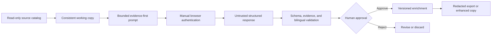

# Research Studio — Engineering Case Study

[](https://github.com/NouraldinFarge/research-studio-case-study/actions/workflows/docs.yml)
[](LICENSE.md)

**A guarded, local-first desktop workflow for enriching a bilingual short-drama catalog without modifying its source database.**

Active private development · 2026 · Verified private alpha 0.1.0-alpha.21

Research Studio began as a module inside a larger Windows product and was extracted into a standalone Electron application. It helps a human reviewer inspect a Chinese short-drama catalog, prepare bounded evidence-first prompts, validate and stage bilingual structured results, approve selected enrichments, and export a documented enhanced SQLite copy.

> **Availability boundary:** This repository is intentionally a **source-free case study**. It contains original documentation and synthetic visuals only. The extracted project does not yet carry a reviewed standalone redistribution license, so application source, portable builds, catalog data, and browser material remain private.

[View Nouraldin Farge's engineering portfolio](https://nouraldin-farge-engineering.awdsqecxzr.chatgpt.site).


## The problem

Catalog enrichment is deceptively risky. The source database must remain trustworthy; model output may be incomplete or malformed; browser authentication must stay under user control; and each accepted result needs enough provenance to be audited or rolled back later.

Research Studio turns those constraints into an explicit review pipeline instead of treating enrichment as a one-click mutation.

## Workflow



1. Open a compatible SQLite catalog in read-only preview mode.
2. Create a consistent working copy before any write-capable operation.
3. Install or verify the versioned enrichment schema on that copy.
4. Prepare a precision prompt or a bounded batch of at most five titles.
5. Complete sign-in, MFA, and CAPTCHA manually in the embedded browser session.
6. Capture the completed structured response, validate schema, evidence, and bilingual consistency, and stage a versioned result in the working copy.
7. Review and approve the staged result for normal enhanced-copy application.
8. Export JSON, CSV, JSONL, or a documented enhanced SQLite copy; approved results are the default enhanced-copy input.

## Engineering decisions

### Preserve the source of truth

Opening a database does not enable writes. Research Studio uses a read-only connection and SQLite `query_only`; write workflows require an explicit working copy. Schema changes create a backup first, and the original description remains untouched.


### Keep authentication out of the application backend

The embedded assistant runs in a dedicated persistent Electron session. Authentication, MFA, and CAPTCHA remain manual, and credentials are not exposed to the renderer or local service.

### Treat model output as untrusted input

Responses pass versioned JSON-schema checks, evidence requirements, and bilingual consistency gates before they are staged for review. Human approval controls normal enhanced-copy application; an explicitly selected validation-passed exception remains available for documented recovery workflows. Batches are deliberately bounded to make review practical.

### Minimize the desktop trust surface

The React renderer communicates through a narrow Electron bridge. In production, the local application service uses a private named pipe; loopback networking is reserved for development. SQLite access, exports, redaction, and guarded capture live behind that boundary.

### Make packaging verifiable and recoverable

The release process runs source verification, native Electron ABI checks, portable smoke tests, archive validation, and transactional active-build deployment. It produces a portable ZIP rather than an installer.


## Architecture at a glance

| Layer | Responsibility |
| --- | --- |
| React + TypeScript | Reviewer workflow and enrichment UI |
| Electron | Sandboxed desktop window and narrow file-picker bridge |
| Express + named pipe | Local application service and private production transport |
| SQLite | Read-only source inspection, working-copy persistence, backups, and exports |
| Zod + JSON contracts | Runtime validation and versioned interchange boundaries |
| Playwright | Guarded browser capture with manual authentication boundaries |
| Optional .NET 8 engine | Preserved research-packet, search, and evidence tooling |

### Trust-boundary sequence

```mermaid
sequenceDiagram
    actor Reviewer
    participant UI as React renderer
    participant Bridge as Narrow Electron bridge
    participant Service as Express service / named pipe
    participant DB as SQLite working copy
    participant Assistant as Embedded assistant session

    Reviewer->>UI: Select source catalog
    UI->>Bridge: Request guarded file selection
    Bridge->>Service: Open read-only and create working copy
    Service->>DB: Enable query_only on source; write only to copy
    DB-->>UI: Return bounded catalog preview
    Reviewer->>UI: Prepare batch (maximum five)
    UI->>Assistant: Send evidence-first prompt
    Reviewer->>Assistant: Complete sign-in, MFA, or CAPTCHA manually
    Assistant-->>UI: Return untrusted structured response
    UI->>Service: Validate schema, evidence, and bilingual fields
    Service->>DB: Stage versioned result and record provenance
    Service-->>Reviewer: Present validation results for approval
    Reviewer->>Service: Approve staged enrichment
    Service-->>UI: Offer redacted export or approved enhanced copy
```

## Verification strategy

The project maintains focused gates for configuration, database safety, whole-library automation, redaction and protection boundaries, prompt safety and quality, capture tracking, API boundaries, embedded and named-pipe backends, packaged backend behavior, Electron native-module compatibility, and portable-release smoke testing.

The dated 2026-08-08 private verification passed 14 focused test/boundary programs, both TypeScript projects, lint and formatting, the production build, packaged named-pipe smoke tests, SQLite integrity and foreign-key checks, Electron/Node native ABI checks, and a forced deployment rollback. Both the production-only and complete locked dependency trees reported zero known npm advisories at verification time.

See the [verification evidence matrix](docs/verification-evidence.md) for exact claims and limitations. The [fabricated export fixture](docs/synthetic-export.example.json) demonstrates the documented shape without exposing a catalog record.

## Failures that improved the system

- A private alpha packaged the Node ABI 137 SQLite binary while Electron required ABI 146; the pipeline now executes a real query under both target runtimes.
- Temporary-path backend startup was replaced by an in-process bundled service and application-private named pipe.
- Assistant capture now binds visible output to the submitted prompt, response shape, record count, and ordered record numbers.
- Portable deployment now has evidence for selective durable-state preservation and rollback after an injected activation failure.

The detailed [engineering notes](docs/engineering-notes.md) explain these failures, the resulting design changes, and what I learned.

## My ownership

I owned product direction, the read-only/working-copy safety model, architecture decisions, trust boundaries, validation and approval workflow, verification strategy, packaging decisions, technical review, and release approval. AI agents assisted with research, implementation, and iteration; their suggestions and generated output were treated as untrusted until reviewed and verified.

Research Studio was extracted from the Research Studio module in SilkReel Windows 5.8.214. This case study does not imply that I created the entire upstream SilkReel application or own rights that were not granted.

## Current boundary and next step

The current private alpha uses Electron 42.8.1 and Node.js 24. A future Tauri/Rust native authority is only a deferred evaluation; it is not the current implementation. That migration would proceed only after feature parity and recovery tests exist. The immediate public-release requirement is written authorization, a reviewed standalone license, and generated third-party notices.

## Technology

Electron · React · TypeScript · Express · SQLite · Zod · Playwright · Vite · Node.js · Windows

## Availability

Source and binaries are not distributed from this repository. This page documents the engineering work without implying redistribution rights that have not been granted.

The written case study is available for portfolio review under [`LICENSE.md`](LICENSE.md). See [`ROADMAP.md`](ROADMAP.md), [`CONTRIBUTING.md`](CONTRIBUTING.md), and [`SECURITY.md`](SECURITY.md) for the documentation and reporting boundaries.
