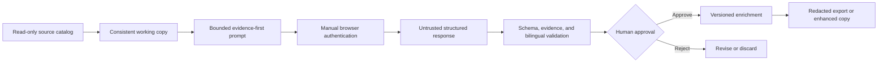

# Research Studio — Engineering Case Study

**A guarded, local-first desktop workflow for enriching a bilingual short-drama catalog without modifying its source database.**

Active development · 2026 · Standalone alpha 0.1.0-alpha.20

Research Studio began as a module inside a larger Windows product and was extracted into a standalone Electron application. It helps a human reviewer inspect a Chinese short-drama catalog, prepare bounded evidence-first prompts, validate bilingual structured results, approve versioned enrichments, and export a documented enhanced SQLite copy.

This repository is intentionally a **source-free case study**. The extracted project does not yet carry a standalone redistribution license, so its implementation and portable builds remain private until that licensing boundary is resolved.

## The problem

Catalog enrichment is deceptively risky. The source database must remain trustworthy; model output may be incomplete or malformed; browser authentication must stay under user control; and each accepted result needs enough provenance to be audited or rolled back later.

Research Studio turns those constraints into an explicit review pipeline instead of treating enrichment as a one-click mutation.

## Workflow

1. Open a compatible SQLite catalog in read-only preview mode.
2. Create a consistent working copy before any write-capable operation.
3. Install or verify the versioned enrichment schema on that copy.
4. Prepare a precision prompt or a bounded batch of at most five titles.
5. Complete sign-in, MFA, and CAPTCHA manually in the embedded browser session.
6. Capture the completed structured response and validate schema, evidence, and bilingual consistency.
7. Review and approve the versioned result.
8. Export JSON, CSV, JSONL, or a documented enhanced SQLite copy.

## Engineering decisions

### Preserve the source of truth

Opening a database does not enable writes. Research Studio uses a read-only connection and SQLite `query_only`; write workflows require an explicit working copy. Schema changes create a backup first, and the original description remains untouched.

### Keep authentication out of the application backend

The embedded assistant runs in a dedicated persistent Electron session. Authentication, MFA, and CAPTCHA remain manual, and credentials are not exposed to the renderer or local service.

### Treat model output as untrusted input

Responses pass versioned JSON-schema checks, evidence requirements, bilingual consistency gates, and human approval before persistence. Batches are deliberately bounded to make review practical.

### Minimize the desktop trust surface

The React renderer communicates through a narrow Electron bridge. In production, the local application service uses a private named pipe; loopback networking is reserved for development. SQLite access, exports, redaction, and guarded capture live behind that boundary.

### Make packaging verifiable and recoverable

The release process runs source verification, native Electron ABI checks, portable smoke tests, archive validation, and transactional active-build deployment. It produces a portable ZIP rather than an installer.

## Architecture at a glance

| Layer | Responsibility |
| --- | --- |
| React + TypeScript | Reviewer workflow and enrichment UI |
| Electron | Sandboxed desktop window and narrow file-picker bridge |
| Express + named pipe | Local application service and private production transport |
| SQLite | Read-only source inspection, working-copy persistence, backups, and exports |
| Zod + JSON contracts | Runtime validation and versioned interchange boundaries |
| Playwright | Guarded browser capture with manual authentication boundaries |
| Optional .NET 8 engine | Preserved research-packet, search, and evidence tooling |

## Verification strategy

The project maintains focused gates for configuration, database safety, whole-library automation, redaction and protection boundaries, prompt safety and quality, capture tracking, API boundaries, embedded and named-pipe backends, packaged backend behavior, Electron native-module compatibility, and portable-release smoke testing.

## My ownership

I owned product direction, the read-only/working-copy safety model, architecture decisions, trust boundaries, validation and approval workflow, verification strategy, packaging decisions, technical review, and release approval. AI agents assisted with research, implementation, and iteration; their suggestions and generated output were treated as untrusted until reviewed and verified.

## Current boundary and next step

The alpha keeps the proven Electron/Node workbench while a future Tauri/Rust native authority is evaluated. That migration is intentionally deferred until feature parity and recovery tests exist. The immediate public-release requirement is a reviewed standalone license and generated third-party notices.

## Technology

Electron · React · TypeScript · Express · SQLite · Zod · Playwright · Vite · Vitest · Node.js · Windows

## Availability

Source and binaries are not distributed from this repository. This page documents the engineering work without implying redistribution rights that have not been granted.

The written case study is available for portfolio review under [`LICENSE.md`](LICENSE.md). See [`ROADMAP.md`](ROADMAP.md), [`CONTRIBUTING.md`](CONTRIBUTING.md), and [`SECURITY.md`](SECURITY.md) for the documentation and reporting boundaries.
