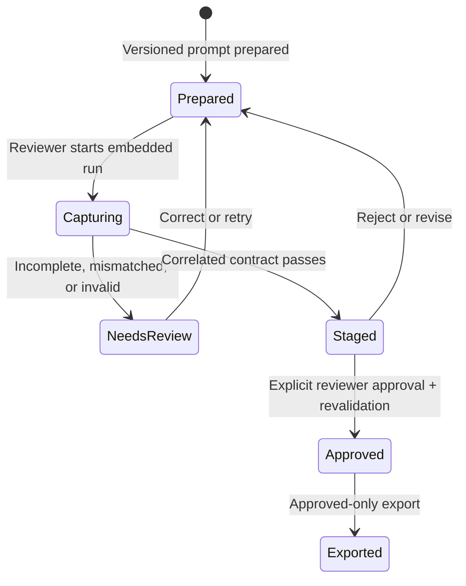

# Approval and whole-library automation

[Case study](../README.md) · [Prompt contract](prompt-contract.md) · [Threat model](threat-model.md)

Research Studio separates three ideas that are often collapsed in AI workflows: **generated**, **valid**, and **approved**.

## Storage lifecycle

| State | What exists | Exportable? | Who advances it? |
| --- | --- | --- | --- |
| Prepared | Job, exact prompt version, expected record identity | No | Reviewer or guarded campaign |
| Capturing | Correlated run/capture progress | No | Embedded assistant provider |
| Needs review | Preserved raw/partial output and actionable errors | No | Reviewer |
| Staged | Normalized draft stored on the job | No | Validator only |
| Approved | Revalidated immutable result version and canonical tag snapshot | Yes | Reviewer only |
| Exported | Documented output plus provenance/audit data | Yes | Reviewer |

The central invariant is simple: **capture never writes a normal result**. Approval is a separate API/storage transition. All export implementations query the approved-result boundary rather than interpreting UI status labels.

## Whole-library campaign

“Automate whole library” is intentionally a review campaign, not a self-approving agent.

1. Compute and display eligible, excluded, correction, and already-approved workload.
2. Require the reviewer to confirm a one-title pilot.
3. Validate and stage the pilot.
4. Continue only after pilot success, using batches of two.
5. Save a checkpoint after each batch.
6. Stop immediately on validation failure, an incomplete response, a zero-save batch, cancellation, or provider trouble.
7. Exclude records already marked for correction so the campaign cannot loop on the same bad output.
8. Resume later from eligible remaining records without discarding completed batches.

No campaign branch invokes approval.

## Why the limits are conservative

- Smaller batches reduce wrong-record mapping and make visible review practical.
- A pilot detects prompt/provider drift before it is amplified across the catalog.
- Immediate checkpoints limit restart loss.
- Correction exclusion prevents infinite retry loops.
- A circuit breaker converts ambiguous quality into a visible stop, not throughput.
- Human approval remains the final semantic decision even when contract validation passes.

## Verification invariants

The private suite checks that:

- every runnable job status is counted and selectable consistently;
- missing eligible records become resumable jobs without touching the source catalog;
- pilot size is one and subsequent campaign batch size is two;
- stopped campaigns retain completed checkpoints;
- zero-save and validation failures stop rather than advance;
- correction records are excluded from unattended selection;
- valid capture creates no result until approval;
- approval revalidates and creates exactly one new result version; and
- every export path excludes staged and needs-review records.

These controls reduce amplification risk. They do not make provider cost, policy, factual accuracy, or reviewer capacity disappear.
