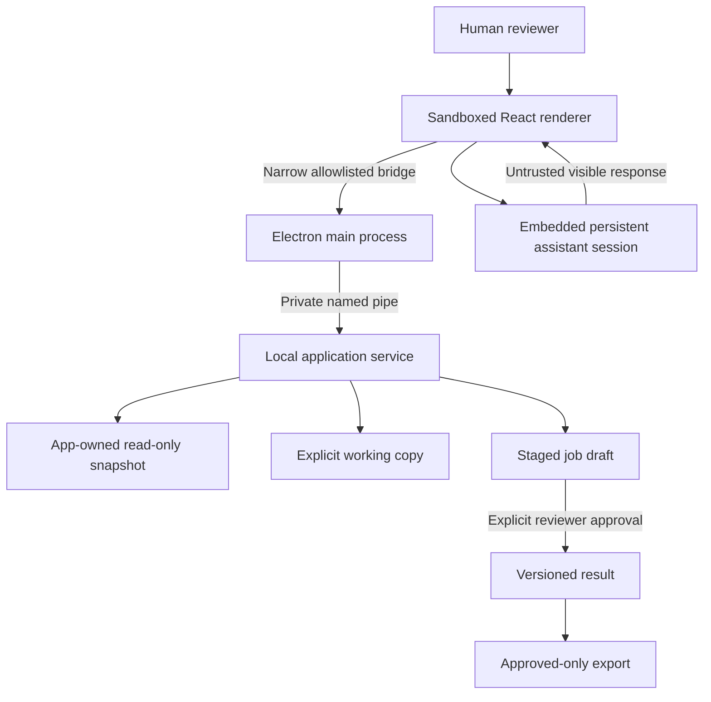

# Threat model

This threat model documents the private Research Studio alpha at a portfolio-safe level. It contains no private endpoints, paths, catalog records, browser state, or exploitable configuration details.

## Protected assets

| Asset | Harm to prevent |
| --- | --- |
| Source catalog | Mutation, coordination sidecars, corruption, or accidental redistribution |
| Working-copy enrichments | Wrong-record mapping, silent overwrite, lost provenance, or unreviewed application |
| Browser session | Credential, cookie, token, conversation, or account-identifier disclosure |
| Local filesystem | Unauthorized path access, private-file inclusion, or diagnostic path leakage |
| Local service authority | Unreviewed calls, unexpected network exposure, oversized request abuse, or renderer privilege expansion |
| Portable state | Upgrade loss, stale executable mixing, or unrecoverable activation failure |
| Public case study | Leakage of private implementation, catalog material, sessions, credentials, or misleading ownership claims |

## Trust boundaries

## Risk and control matrix

| Threat | Preventive controls | Detection or recovery | Residual risk |
| --- | --- | --- | --- |
| Source database touched during preview | App-owned snapshot, read-only connection, `query_only`, centralized write authorization | Source size/time and sidecar comparison; blocked-mutation tests | Filesystem or SQLite behavior can vary across environments |
| Model response belongs to another prompt | Submitted-turn, shape, count, and ordered-record correlation | Mismatch stops safely and leaves text available for review | Website markup changes can interrupt capture |
| Model output is valid JSON but poor metadata | Required-field, evidence, description, bilingual-tag, and identity validation | Needs-review states, retry, continuation, and human review | No automated gate can guarantee factual correctness |
| Valid output bypasses human approval | Capture writes a staged job draft only; approval is a distinct revalidation command; every export is approved-only | Storage/API tests verify no result before approval and reject unapproved enhanced-copy input | A reviewer can still approve an inaccurate result |
| Whole-library loop amplifies a bad response | Workload preview, one-title pilot, two-title batches, checkpoints, correction exclusion, zero-save/validation circuit breaker | Safe stop/resume and campaign tests | Provider cost, policy, or correlated-but-plausible errors still require oversight |
| Prompt changes erase provenance | Active/used prompt versions are immutable; revisions receive new identity | Usage-count and revision tests | A poor historical prompt remains part of audit history |
| Unknown or mismatched bilingual tags enter storage | Assistant returns canonical IDs only; labels derive from a local taxonomy | Unknown, duplicate, unsupported-premise, and migration tests | Taxonomy coverage and category choices still need product review |
| Credentials exposed through automation | Dedicated session, manual sign-in/MFA/CAPTCHA, no credential bridge | Redacted diagnostics and bounded browser audit records | The assistant website and account remain external systems |
| Browser navigation reaches an internal target | Reviewed HTTP/HTTPS policy, literal-address checks, bounded DNS verification, redirect/final-URL checks | Policy audit records omit query strings and secrets | DNS and remote-site behavior can change after checks |
| Renderer gains broad desktop authority | Sandbox, context isolation, narrow preload API, centralized service authorization | Boundary tests and packaged-interface smoke tests | Electron and dependency vulnerabilities remain supply-chain risks |
| Production service exposed over TCP | Application-private Windows named pipe; loopback transport restricted to development | Packaged smoke checks that no development server can satisfy | Other same-user local processes remain part of the host trust model |
| Diagnostic or export leaks private data | Shareable output defaults to redaction; full-local reports remain private | Publication scan blocks common secrets, paths, databases, archives, and browser artifacts | Novel identifiers may require manual review |
| Portable upgrade destroys state | Preserve only durable data, temporary verified extraction, prior-build retention | Injected activation failure and rollback verification | Clean-machine compatibility still requires manual release validation |
| Native SQLite package cannot load | Explicit Electron rebuild and target-runtime query | Query under Electron ABI 146 and restored Node ABI 137 | Future runtime upgrades require renewed verification |
| Crash leaves work falsely active | Transitional job/run states are reconciled when a working copy opens | Startup-recovery fixtures and durable restart reasons | Canonical per-job artifact folders remain future work |

## Human authority

The reviewer remains responsible for:

- choosing the catalog and creating or opening the working copy;
- starting, stopping, resuming, or cancelling assistant work;
- completing account-security challenges;
- interpreting sources and reviewing model-produced metadata;
- approving a staged draft so a versioned result can exist; and
- deciding whether an export is appropriate to share.

The application does not guarantee model accuracy, bypass website controls, or turn an approved schema into evidence that a particular enrichment is true.

## Public evidence boundary

The public repository may contain aggregate counts, bounded verification outcomes, fabricated fixtures, original diagrams, and synthetic-fixture UI captures that show no machine path or browser/account pane. It must not contain application binaries, source, real catalog subsets, account/browser captures, conversations, credentials, local diagnostics, or third-party material without reviewed rights.

See [Security policy](../SECURITY.md) for private reporting and [Verification evidence](verification-evidence.md) for the dated test snapshot.
